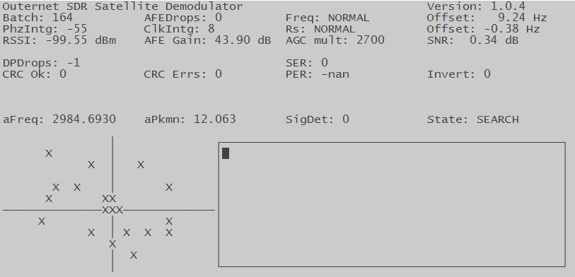

Running the programs
====================

We are now ready to run the demodulator and the decoder. Before we do that,
though, we need to connect the radio and the antenna.

Connect the antenna's connector to the LNA. Next, connect the LNA to the
RTL-SDR dongle. Finally, plug the dongle into your computer's USB port.

Running the demodulator
-----------------------

The demodulator needs a few parameters so it knows how to set up the tuner. The
``demod-presets`` command makes this easier by providing presets for the known
frequencies. If you run this command without any arguments, you will get a list
of presets (among other things)::

    $ sudo demod-presets
    Usage:
      /usr/local/bin/demod-presets PROFILE
      /usr/local/bin/demod-presets update

    parameters:

      PROFILE   name of the tuner profile
      update    fetch the latest profiles

    supported profiles:

      americas  North and South Americas
      euraf     Europe, Africa, Middle East
      apac      Asia, Pacific

Pick a preset for your region and run ``demod-presets`` again. For example,
let's run it with ``euraf`` preset::

    $ sudo demod-presets euraf

Running the decoder
-------------------

With the demodulator running, open up a new terminal window to start the
decoder.

    $ sudo decoder

Output from the decoder will be logged in the terminal where you started it.

What next?
----------

It will take a while for the files to arrive, so please be patient. You may
also need to adjust the antenna so it's pointed correctly. Antenna pointing is
outside the scope of this guide, though. The best place to ask for help
regarding this is `our forum <https://discuss.outernet.is/>`_.

When successfully downloaded, files should appear in the output directory. If
you used the values from this guide, that's ``/srv/downloads``.
