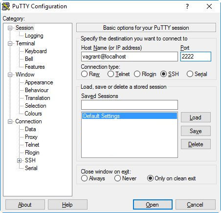

Installing the Outernet software in a virtual machine
=====================================================

The Outernet software can be run within a virtual machine on platforms
supported by `VirtualBox <https://virtualbox.org/>`_. As of this writing, this
includes Linux, Windows, OSX, OpenSolaris, and OpenBSD.

.. note::
    It is highly recommended to use this set-up on a CPU that supports hardware
    virtualization technologies.

To use the virtual machine set-up, you will need to install VirtualBox, 
`Oracle VirtualBox Extension Pack
<http://www.oracle.com/technetwork/server-storage/virtualbox/downloads/index.html#extpack>`_,
and `Vagrant <https://www.vagrantup.com/>`_.

Once the required software is installed, download the `Outernet
demodulator/decoder kit
<https://github.com/Outernet-Project/outernet-linux-lband/archive/master.zip>`_,
and unzip it. Open a console and navigate to the folder which contains the
unpacked files. For example, on Windows::

    C:\> cd \path\to\outernet-linux-lband-master
    C:\path\to\outernet-linux-lband-master> vagrant up

On Linux and other Unix-like or Unix systems, the commands are exactly the
same::

    $ cd /path/to/outernet-linux-lband-master
    $ vagrant up

After downloading all the base image, a VirtualBox virtual machine is created
and brought up. The machine is accessed using SSH.

Common RTL-SDR USB dongles are configured to be forwarded to the virtual
machine, so plugging them in should be enough to make them usable within the
virtual machine.

.. note::
    While the virtual machine is running, you will not be able to use the radio
    USB dongles on the host system.

To access the operating system running within the virtual machine, run::

    $ vagrant ssh

If you are on Windows, and you don't have OpenSSH installed, you can use `PuTTY
<http://www.putty.org/>`_. In the host name field, type in
``vagrant@localhost``, and type ``2222`` in the port field.

The password is ``vagrant``.

To run the Outernet software, follow the :doc:`running` section.

To stop the virtual machine from the command line, use the following command::

    $ vagrant halt
